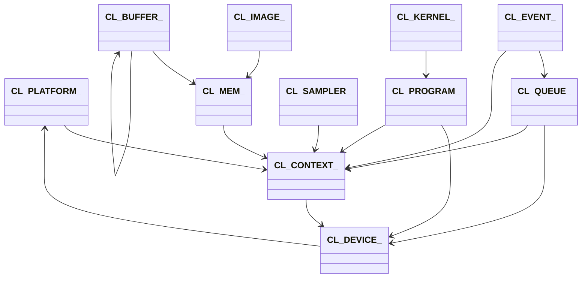

# iomap_opencl

### HTML5 Canvas Visualisation of the OpenCL Compute Pipeline and various Kernel Stages

```mermaid
classDiagram

CL_PLATFORM_ --> CL_CONTEXT_
CL_DEVICE_ --> CL_PLATFORM_

CL_QUEUE_ --> CL_DEVICE_
CL_QUEUE_ --> CL_CONTEXT_

CL_EVENT_ --> CL_QUEUE_
CL_EVENT_ --> CL_CONTEXT_

CL_PROGRAM_ --> CL_DEVICE_
CL_KERNEL_ --> CL_PROGRAM_

CL_PROGRAM_ --> CL_CONTEXT_
CL_CONTEXT_ --> CL_DEVICE_

CL_MEM_ --> CL_CONTEXT_
CL_SAMPLER_ --> CL_CONTEXT_

CL_BUFFER_ --> CL_MEM_
CL_IMAGE_ --> CL_MEM_

CL_BUFFER_ --> CL_BUFFER_
```
