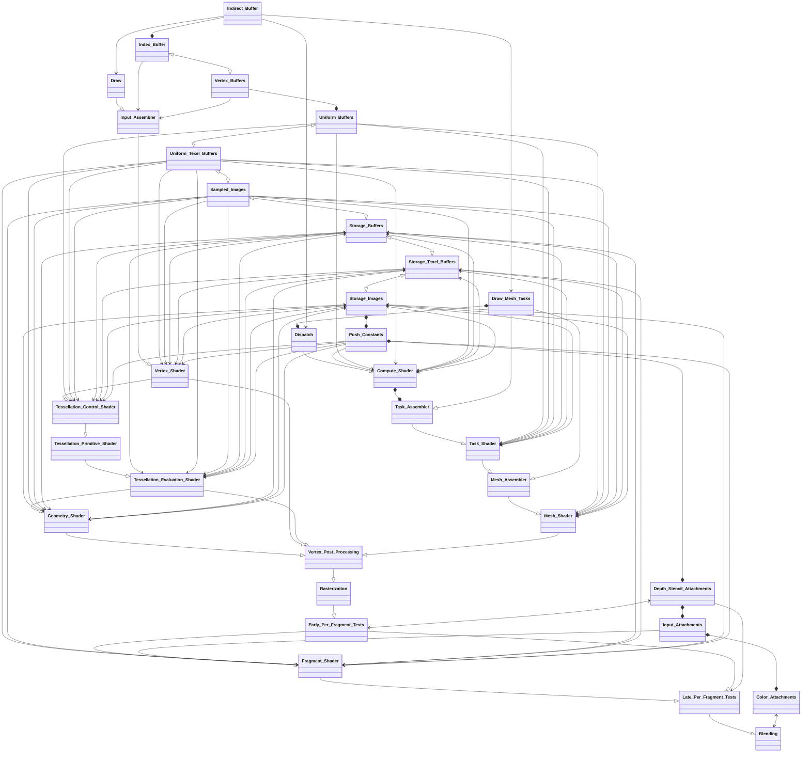

# iomap_vulkan

### HTML5 Canvas Visualisation of the Vulkan Graphics Pipeline and various Shader Stages

```mermaid
classDiagram

Draw --|> Input_Assembler
Input_Assembler --|> Vertex_Shader
Vertex_Shader --|> Tessellation_Control_Shader
Tessellation_Control_Shader --|> Tessellation_Primitive_Shader
Tessellation_Primitive_Shader --|> Tessellation_Evaluation_Shader
Tessellation_Evaluation_Shader --|> Geometry_Shader
Geometry_Shader --|> Vertex_Post_Processing
Vertex_Post_Processing --|> Rasterization
Rasterization --|> Early_Per_Fragment_Tests
Early_Per_Fragment_Tests --|> Fragment_Shader
Fragment_Shader --|> Late_Per_Fragment_Tests
Late_Per_Fragment_Tests --|> Blending

Indirect_Buffer --* Index_Buffer
Index_Buffer <|--|> Vertex_Buffers
Vertex_Buffers --* Uniform_Buffers
Uniform_Buffers <|--|> Uniform_Texel_Buffers
Uniform_Texel_Buffers <|--|> Sampled_Images
Sampled_Images <|--|> Storage_Buffers
Storage_Buffers <|--|> Storage_Texel_Buffers
Storage_Texel_Buffers <|--|> Storage_Images
Storage_Images *--* Push_Constants
Push_Constants *--* Depth_Stencil_Attachments
Depth_Stencil_Attachments *--* Input_Attachments
Input_Attachments *--* Color_Attachments

Draw_Mesh_Tasks *--* Dispatch
Dispatch --|> Compute_Shader
Compute_Shader *--* Task_Assembler
Task_Assembler --|> Task_Shader
Task_Shader --|> Mesh_Assembler
Mesh_Assembler --|> Mesh_Shader

Vertex_Shader --|> Vertex_Post_Processing
Tessellation_Evaluation_Shader --|> Vertex_Post_Processing
Early_Per_Fragment_Tests --|> Late_Per_Fragment_Tests

Draw_Mesh_Tasks --|> Task_Assembler
Draw_Mesh_Tasks --|> Mesh_Assembler
Mesh_Shader --|> Vertex_Post_Processing

Indirect_Buffer --> Draw
Index_Buffer --> Input_Assembler
Vertex_Buffers --> Input_Assembler
Uniform_Buffers --> Tessellation_Control_Shader
Storage_Buffers <--> Tessellation_Evaluation_Shader
Storage_Images <--> Geometry_Shader
Depth_Stencil_Attachments <--> Early_Per_Fragment_Tests
Depth_Stencil_Attachments --> Late_Per_Fragment_Tests
Input_Attachments --> Fragment_Shader
Color_Attachments <--> Blending

Indirect_Buffer --> Draw_Mesh_Tasks
Indirect_Buffer --> Dispatch
Push_Constants --> Compute_Shader

Uniform_Texel_Buffers --> Vertex_Shader
Uniform_Texel_Buffers --> Tessellation_Control_Shader
Uniform_Texel_Buffers --> Tessellation_Evaluation_Shader
Uniform_Texel_Buffers --> Geometry_Shader
Uniform_Texel_Buffers --> Fragment_Shader

Sampled_Images --> Vertex_Shader
Sampled_Images --> Tessellation_Control_Shader
Sampled_Images --> Tessellation_Evaluation_Shader
Sampled_Images --> Geometry_Shader
Sampled_Images --> Fragment_Shader

Storage_Buffers <--> Vertex_Shader
Storage_Buffers <--> Tessellation_Control_Shader
Storage_Buffers <--> Tessellation_Evaluation_Shader
Storage_Buffers <--> Geometry_Shader
Storage_Buffers <--> Fragment_Shader

Storage_Texel_Buffers <--> Vertex_Shader
Storage_Texel_Buffers <--> Tessellation_Control_Shader
Storage_Texel_Buffers <--> Tessellation_Evaluation_Shader
Storage_Texel_Buffers <--> Geometry_Shader
Storage_Texel_Buffers <--> Fragment_Shader

Storage_Images <--> Vertex_Shader
Storage_Images <--> Tessellation_Control_Shader
Storage_Images <--> Tessellation_Evaluation_Shader
Storage_Images <--> Geometry_Shader
Storage_Images <--> Fragment_Shader

Push_Constants --> Vertex_Shader
Push_Constants --> Tessellation_Control_Shader
Push_Constants --> Tessellation_Evaluation_Shader
Push_Constants --> Geometry_Shader
Push_Constants --> Fragment_Shader

Uniform_Buffers --> Compute_Shader
Uniform_Buffers --> Task_Shader
Uniform_Buffers --> Mesh_Shader

Uniform_Texel_Buffers --> Compute_Shader
Uniform_Texel_Buffers --> Task_Shader
Uniform_Texel_Buffers --> Mesh_Shader

Sampled_Images --> Compute_Shader
Sampled_Images --> Task_Shader
Sampled_Images --> Mesh_Shader

Storage_Buffers <--> Compute_Shader
Storage_Buffers <--> Task_Shader
Storage_Buffers <--> Mesh_Shader

Storage_Texel_Buffers <--> Compute_Shader
Storage_Texel_Buffers <--> Task_Shader
Storage_Texel_Buffers <--> Mesh_Shader

Storage_Images <--> Compute_Shader
Storage_Images <--> Task_Shader
Storage_Images <--> Mesh_Shader
```
